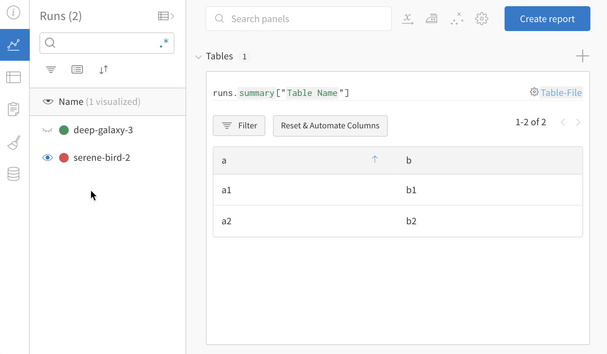
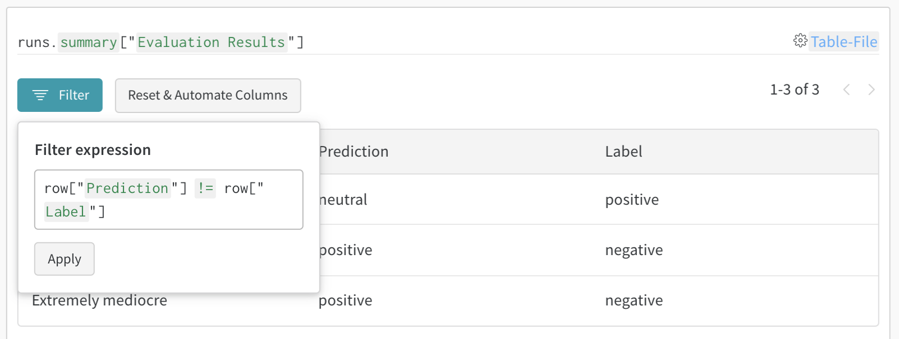

# Tables Quickstart

Explore how to use W&B Tables with this 5 minute quickstart, which runs through how to log data tables, then visualize and query that data. Click the button below to try a PyTorch quickstart example project on MNIST data.

[](http://wandb.me/tables-quickstart)

## 1. Log a table

Initialize a run, create a `wandb.Table()`, then log it to the run.

```python
run = wandb.init(project="table-test")
my_table = wandb.Table(columns=["a", "b"], data=[["a1", "b1"], ["a2", "b2"]])
run.log({"Table Name": my_table})
```

## 2. Visualize tables in the workspace

See the resulting table in the workspace. A new panel is added for each unique table key. In the above example, `my_table` is logged under the key `Table Name`, which creates the displayed table below:


## 3. Compare across model versions

Log sample tables from multiple different runs, then compare results in the project workspace. In this [example workspace](https://wandb.ai/carey/table-test?workspace=user-carey), we show how to combine rows from multiple different versions in the same table.



Use the table filter, sort, and grouping features to explore and evaluate model results.




Now that you've run through the quickstart, learn more about the power and flexibility of tables:






