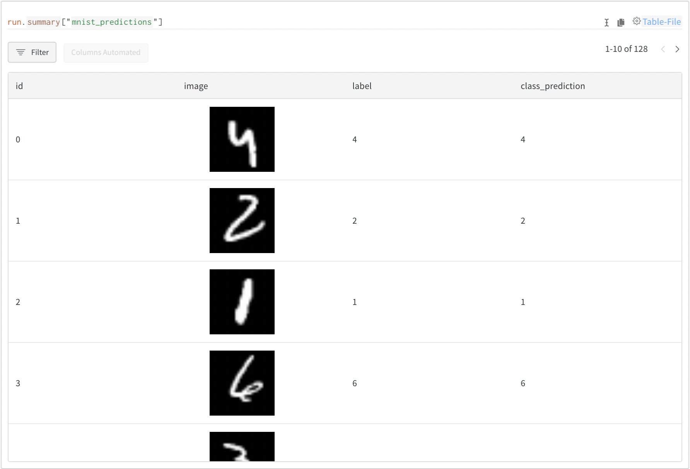

# Fastai

If you're using **fastai** to train your models, W\&B has an easy integration using the `WandbCallback`. Explore the details in[ interactive docs with examples →](https://app.wandb.ai/borisd13/demo_config/reports/Visualize-track-compare-Fastai-models--Vmlldzo4MzAyNA)

## Start Logging with W\&B

First install Weights & Biases and log in:



```python
!pip install wandb

import wandb
wandb.login()
```



```python
pip install wandb
wandb login
```



Then add the callback to the `learner` or `fit` method:

```python
import wandb
from fastai.callback.wandb import *

# start logging a wandb run
wandb.init(project='my_project')

# To log only during one training phase
learn.fit(..., cbs=WandbCallback())

# To log continuously for all training phases
learn = learner(..., cbs=WandbCallback())
```


If you use version 1 of Fastai, refer to the [Fastai v1 docs](v1.md).


## WandbCallback Arguments

`WandbCallback` accepts the following arguments:

| Args         | Description                                                                                                                                                                                                                        |
| ------------ | ---------------------------------------------------------------------------------------------------------------------------------------------------------------------------------------------------------------------------------- |
| log          | "gradients" (default), "parameters", "all" or None. Losses & metrics are always logged.                                                                                                                                            |
| log_preds    | whether we want to log prediction samples (default to True).                                                                                                                                                                       |
| log_model    | whether we want to log our model (default to True). This also requires SaveModelCallback.                                                                                                                                          |
| log_dataset  | <ul><li>False (default)</li><li>True will log folder referenced by learn.dls.path.</li><li>a path can be defined explicitly to reference which folder to log.</li></ul><p><em>Note: subfolder "models" is always ignored.</em></p> |
| dataset_name | name of logged dataset (default to folder name).                                                                                                                                                                                   |
| valid_dl     | `DataLoaders` containing items used for prediction samples (default to random items from `learn.dls.valid`.                                                                                                                        |
| n_preds      | number of logged predictions (default to 36).                                                                                                                                                                                      |
| seed         | used for defining random samples.                                                                                                                                                                                                  |

For custom workflows, you can manually log your datasets and models:

* `log_dataset(path, name=None, medata={})`
* `log_model(path, name=None, metadata={})` 

_Note: any subfolder "models" will be ignored._

## Data Visualization with W\&B Tables

Use [W\&B Tables](https://docs.wandb.ai/guides/data-vis) to log, query, and analyze your data. You can think of a W\&B Table as a `DataFrame` that you can interact with inside W\&B. Tables support rich media types, primitive and numeric types, as well as nested lists and dictionaries.

This pseudo-code shows you how to log images, along with their ground truth and predicted class, to W\&B Tables:

```python
# Create a new W&B Run
wandb.init(project="mnist")

# Create a W&B Table
my_table = wandb.Table(columns=["id", "image", "labels", "prediction"])

# Get your image data and make predictions
image_tensors, labels = get_mnist_data()
predictions = model(image_tensors)

# Add your image data and predictions to the W&B Table
for idx, im in enumerate(image_tensors): 
  my_table.add_data(idx, wandb.Image(im), labels[idx], predictions[id])

# Log your Table to W&B
wandb.log({"mnist_predictions": my_table})
```

This is will produce a Table like this:



For more examples of data visualization with W\&B Tables, please see [the documentation](https://docs.wandb.ai/guides/data-vis).

## Examples

* [Visualize, track, and compare Fastai models](https://app.wandb.ai/borisd13/demo_config/reports/Visualize-track-compare-Fastai-models--Vmlldzo4MzAyNA): A thoroughly documented walkthrough
* [Image Segmentation on CamVid](http://bit.ly/fastai-wandb): A sample use case of the integration
