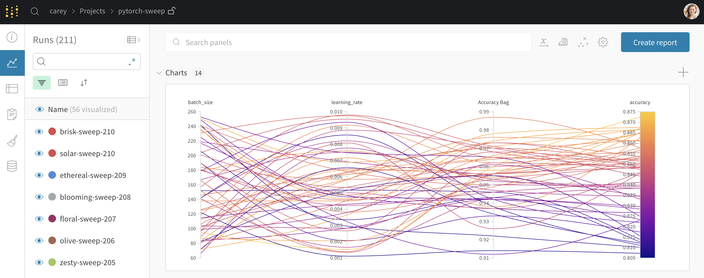

# Quickstart

Build better models more efficiently with Weights & Biases experiment tracking.


### 1. Set up wandb

[Sign up](https://app.wandb.ai/login?signup=true) for a free account and install the library `wandb` in a Python 3 environment from the command line. In a notebook, call `wandb.login()` in Python istead.

```bash
pip install wandb
wandb login
```

### 2. Start a new run

Initialize a new run in W&B in your Python script or notebook. `wandb.init()` will start tracking system metrics and console logs, right out of the box. Run your code, put in [your API key](https://wandb.ai/authorize) when prompted, and you'll see the new run appear in W&B. [  
More about wandb.init\(\) →](guides/track/launch.md)

```python
import wandb
wandb.init(project="my-test-project")
```

### 3. Track metrics

Use `wandb.log()` to track metrics, or a framework [integration](guides/integrations/) for easy instrumentation.   
[More about wandb.log\(\) →](guides/track/log.md)

```python
wandb.log({'accuracy': train_acc, 'loss': train_loss})
```


###  4. Track hyperparameters

Save hyperparameters so you can quickly compare experiments.   
[More about wandb.config →](guides/track/config.md)

```python
wandb.config.dropout = 0.2
```



## What next?

1. \*\*\*\*[**Collaborative Reports**](guides/reports.md): Snapshot results, take notes, and share findings
2. \*\*\*\*[**Data + Model Versioning**](guides/artifacts/): Track dependencies and results in your ML pipeline
3. \*\*\*\*[**Data Visualization**](guides/data-vis/)**:** Visualize and query datasets and model evaluations
4. \*\*\*\*[**Hyperparameter Tuning**](guides/sweeps/): Quickly automate optimizing hyperparameters



### Reports

* Snapshot visualizations and comparisons
* Capture notes during the course of your research
* Share highlights with collaborators or your boss

[More about Reports →](guides/reports.md)



### Artifacts

* Save 











## Common Questions

**Where do I find my API key?**  
Once you've logged in, it will be on the [Authorize page](https://wandb.ai/authorize).

**How do I use W&B in an automated environment?**  
If you are training models in an automated environment where it's inconvenient to run shell commands, such as Google's CloudML, you should look at our guide to configuration with [Environment Variables](guides/track/advanced/environment-variables.md).

**Do you offer on-prem installs?**  
Yes, you can [self-host W&B Local](guides/self-hosted/) on your own machines or in a private cloud.

**How do I turn off wandb logging temporarily?**  
If you're testing code and want to disable wandb syncing, set the environment variable [`WANDB_MODE=offline`](guides/track/advanced/environment-variables.md).


