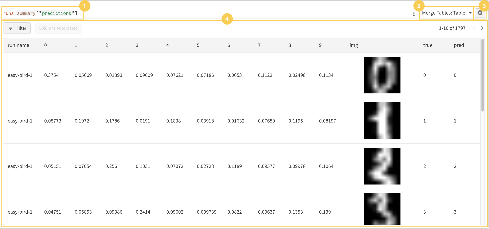
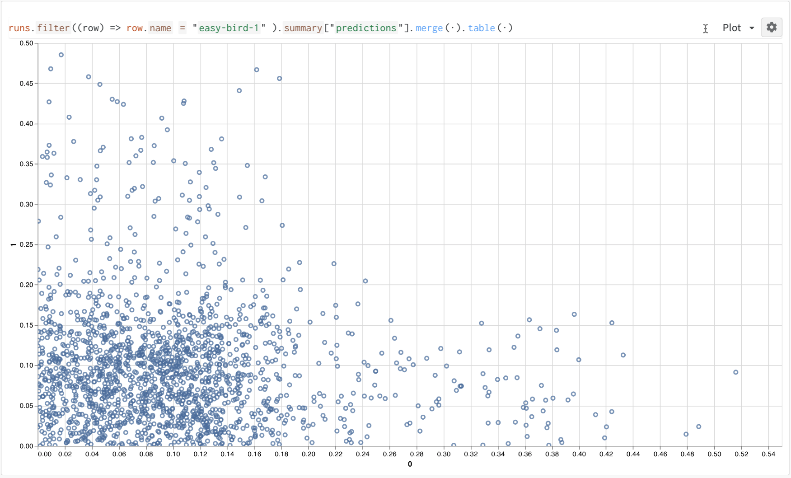
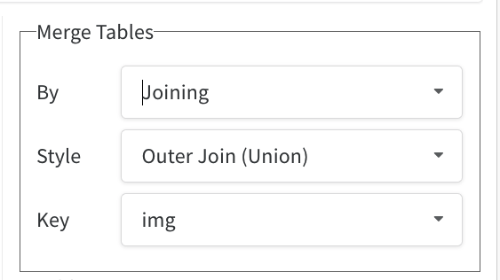
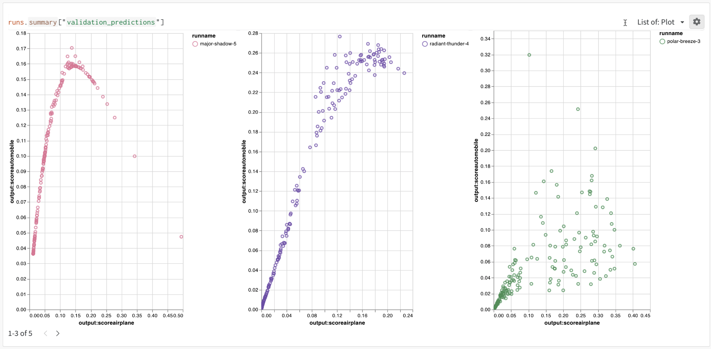
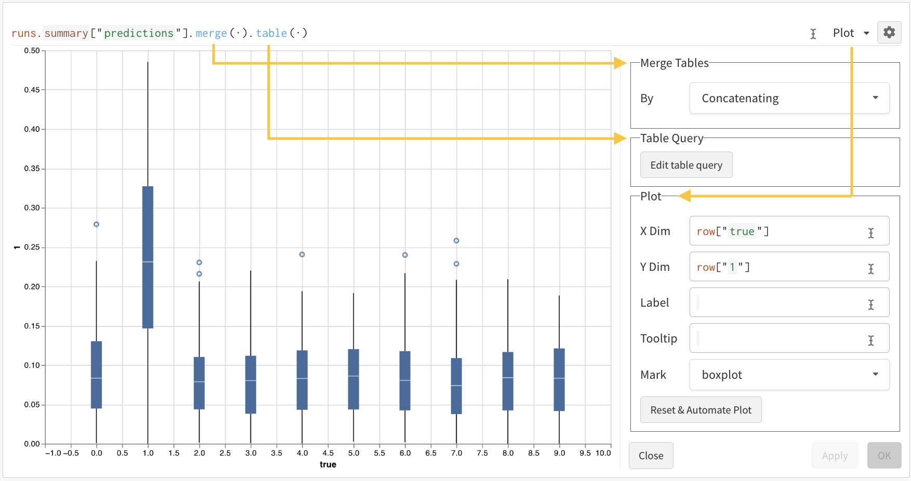
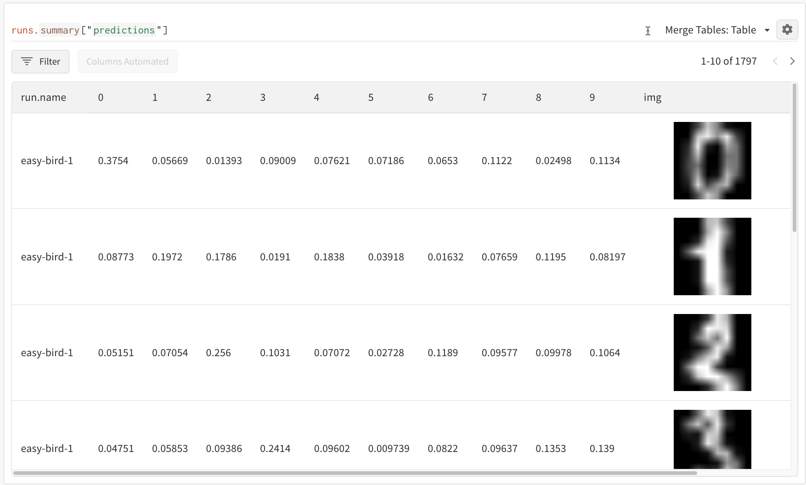
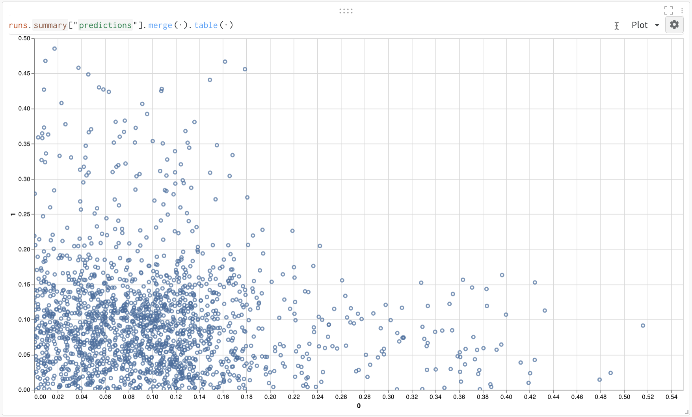

# Weave

## Introduction

Weave Panels allow users to directly query W&B for data, visualize the results, and further analyze interactively. Weave Panels have 4 primary components, as illustrated in the image below:

1. The **Weave Expression**: specifies the query to execute against W&B's backend
2. The **Weave Panel Selector**: specifies the Panel used to display the results of the query.
3. The **Weave Configuration**: enables the user to configure the parameters of the Weave Expression and/or Weave Panel
4. The **Weave Result Panel**: the primary area of the Weave Panel, displaying the result of the Weave Expression query, using the Weave Panel and Configuration specified.

To try out Weave, Tables, and Plots right away, please checkout this [interactive Report](https://wandb.ai/timssweeney/keras_learning_rate/reports/Announcing-W-B-Weave-Plot--VmlldzoxMDIyODM1).

## Components

### Weave Expression

Weave Expressions allow the user to query the data stored in W&B - from runs, to artifacts, to models, to tables, and more! The most common Weave Expression is generated from logging a Table,`wandb.log({"predictions":<MY_TABLE>})`, and will look like this:

Let's break this down:

* `runs` is a **variable** automatically injected in Weave Panel Expressions when the Weave Panel is in a Workspace. Its "value" is the list of runs which are visible for that particular Workspace.
* `summary` is an **op** which returns the Summary object for a Run. Note: **ops** are "mapped", meaning this **op** is applied to each Run in the list, resulting in a list of Summary objects.
* `["predictions"]` is a Pick **op** \(denoted with brackets\), with a **parameter** of "predictions". Since Summary objects act like dictionaries or maps, this operation "picks" the "predictions" field off of each Summary object. As noted above, the "predictions" field is a Table, and therefore this query results in the Table above.

Weave expressions are extremely powerful, for example, the following expression says:

* Filter my runs to just those whose `name = "easy-bird-1"`
* Get their Summary objects
* Pick the "Predictions" value
* Merge the Tables
* Query the Tables
* Plot the results

Note that the Merge, Query, and Plot configuration is specified in the Weave Configuration \(discussed below\). Please refer to the Weave Expression Docs for a full discussion of Ops, Types, and other characteristics of this query language.

### Weave Panel Selector

After when constructing a Weave Expression, the Weave Panel will automatically select a panel to use to display the results. The most common Panel for the resulting datatype is automatically selected. However, if you wish to change the panel, simply click the dropdown and select a different panel.

There are a few special case to be aware of:

1. If you are currently viewing a Table, then a `Plot table query` option will be available in addition to all the other normal options. Selecting this option means that you want to plot the results of the _current table query_. So, if you have perhaps added a custom field, grouped, sorted, filtered, or otherwise manipulated the table, you can select `Plot table query` to use the current results as the input to the plot.
2. `Merge Tables: <Panel>` is a special case where the incoming datatype is a List of Tables. In such cases, the "Merge Tables" portion of the panel allows users to either concatenate all the rows, or join the tables on a particular column. This setting is configured in the Weave Configuration \(discussed below\) and shown in the following screen shots

      

3. `List of: <Panel>` is a special case where the incoming datatype is a List - and you wish to display a paginated view of panels. The following example shows `List of: Plot` , where each plot is from a different run

### Weave Configuration

Clicking the Gear icon  in the upper right corner will expand the Weave Configuration. This allows the user to configure the parameters for certain expression ops as well as the result panel. For example:

In the above example, we see 3 section in the expanded Weave Configuration:

1. `Merge Tables`: the `merge` op in the expression has additional configuration properties \(in this case Concatenate or Join\) which are exposed here.
2. `Table Query` : the `table` op in the expression represents a table query applied to the results - users can edit the table query interactively by clicking the `Edit table query` button.
3. `Plot`: finally, after any expression ops are configured, the Result Panel itself can be configured. In this case, the `Plot` panel has configuration for setting the dimensions and other plot characteristics. Here, we have configured a boxplot with the categorical ground truth value along the x axis, and the model's predicted score for the "1" class along the y axis. As we would expect, the distribution of scores for "1" is notable higher than the other classes.

### Weave Result Panel

Finally, the Weave Result Panel renders the result of the Weave Expression, using the selected Weave Panel, configured by the configuration to display the data in an interactive form. Here we can see a Table and a Plot of the same data

## Creating Weave Panels

Weave Panels are automatically created whenever a user [logs a Table ](../../../../guides/data-vis/log-tables.md)or [logs a Custom Chart](../custom-charts/). In such cases, will automatically set the Weave Expression to `run.summary["<TABLE_NAME>"]` and render the Table Panel. Furthermore, you can directly add a Weave Panel to a workspace by selecting the `Weave` Panel from the "add panel" button.

